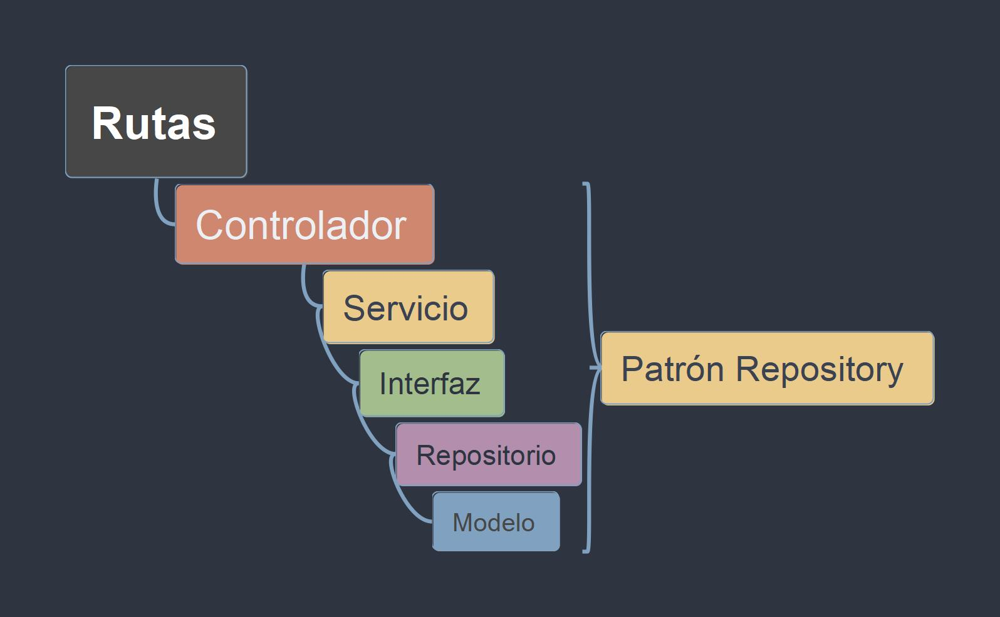

# Laravel ASAWL - 06. Diseño Inseguro

## Diseño Inseguro en Laravel y el Patrón Repository

En el contexto de Laravel, un diseño inseguro se refiere a la implementación de prácticas que exponen la aplicación a vulnerabilidades y riesgos de seguridad. Uno de los problemas comunes es la lógica de negocio mezclada con el código de acceso a datos directamente en los Controladores o Modelos. Esto viola el principio de responsabilidad única (SRP) y dificulta el mantenimiento, las pruebas y la escalabilidad.

### Problemas de un Diseño Inseguro

-   Acoplamiento Estrecho: La lógica de negocio entrelazada con el acceso a datos crea una fuerte dependencia entre capas, lo que dificulta modificar o reemplazar componentes sin afectar a otros.
-   Código Duplicado: La misma lógica de acceso a datos puede repetirse en varios controladores o modelos, lo que aumenta la probabilidad de errores y dificulta la actualización.
-   Dificultad para Realizar Pruebas: La falta de separación dificulta la creación de pruebas unitarias efectivas, ya que los componentes están estrechamente acoplados.

### El Patrón Repository como Solución

El patrón Repository actúa como una capa de abstracción entre la lógica de negocio y el acceso a datos. Proporciona una interfaz bien definida para interactuar con los datos, ocultando los detalles de implementación específicos (Eloquent ORM, consultas SQL directas, etc.).

#### Beneficios del Patrón Repository

-   Desacoplamiento: Separa la lógica de negocio del acceso a datos, lo que permite modificar o reemplazar la implementación de la capa de datos sin afectar la lógica de negocio.
-   Reutilización de Código: Centraliza la lógica de acceso a datos en un solo lugar, evitando la duplicación y facilitando el mantenimiento.
-   Facilidad de Pruebas: Permite crear fácilmente pruebas unitarias para la lógica de negocio, utilizando mocks o stubs para simular la capa de datos.
-   Flexibilidad: Facilita la adaptación a diferentes tipos de almacenamiento de datos (bases de datos relacionales, NoSQL, APIs externas) sin cambiar la lógica de negocio.

### Implementación en Laravel

Laravel no impone una estructura rígida para los repositorios, pero una implementación común implica:

-   Controlador (Controller): Gestiona las solicitudes HTTP, delega la lógica de negocio a los servicios y devuelve las respuestas.
-   Servicio (Service): Contiene la lógica de negocio de la aplicación. Interactúa con los repositorios para realizar operaciones de datos.
-   Interfaz (Interface): Define un contrato para las operaciones de datos que el repositorio debe implementar.
-   Repositorio (Repository): Implementa la interfaz y proporciona métodos para acceder y manipular los datos del modelo.
-   Modelo (Model): Representa la estructura de los datos y, a menudo, interactúa directamente con la base de datos a través de Eloquent ORM en Laravel.
-   Helper: Contiene funciones auxiliares que pueden ser utilizadas por otros componentes.

### Flujo de Trabajo:

1.  El controlador recibe una solicitud HTTP.
2.  El controlador invoca los métodos del servicio para manejar la lógica de negocio.
3.  El servicio utiliza la interfaz del repositorio para realizar operaciones de datos.
4.  El repositorio implementa la interfaz y interactúa con el modelo para acceder a la base de datos.
5.  El modelo realiza las operaciones de base de datos necesarias y devuelve los resultados al repositorio.
6.  El repositorio devuelve los datos al servicio.
7.  El servicio procesa los datos y los devuelve al controlador.
8.  El controlador devuelve una respuesta HTTP al cliente.
